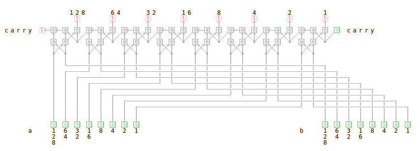
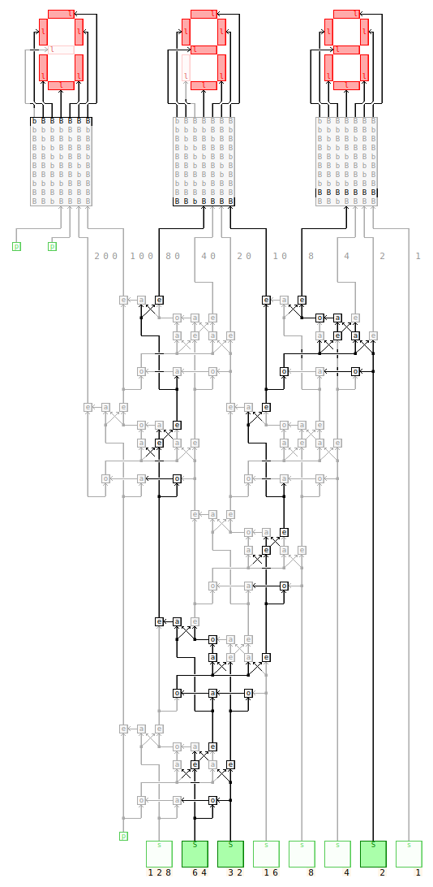

# LogicEmu

LogicEmu is a logic circuit emulator that runs in the browser.

View demo running here: http://lodev.org/logicemu/

LogicEmu supports logic gates, switches, LEDs, flip-flops, combinational logic, sequential logic, integrated circuits, ROMs, displays, ... in an ASCII notation or rendered with HTML5.

For example this:

```
            "128"  "64"  "32"  "16"  "8"   "4"   "2"   "1"
              l     l     l     l     l     l     l     l
              ^     ^     ^     ^     ^     ^     ^     ^
 "carry"l<o<a e o<a e o<a e o<a e o<a e o<a e o<a e o<a e s"carry"
          ^ ^^^/^ ^^^/^ ^^^/^ ^^^/^ ^^^/^ ^^^/^ ^^^/^ ^^^/
          a e * a e * a e * a e * a e * a e * a e * a e *
          ^^^   ^^^   ^^^   ^^^   ^^^   ^^^   ^^^   ^^^
          | |   | |   | |   | |   | |   | |   | |   | |
          | |   | |   | |   | |   | |   | |   | |   | |
          | ,---+-+---+-+---+-+---+-+---+-+---+-+---+-+-*
          | ,---* *---+-+---+-+---+-+---+-+---+-+---+-+-+-*
          | | *-------* *---+-+---+-+---+-+---+-+---+-+-+-+-*
          | | | *-----------* *---+-+---+-+---+-+---+-+-+-+-+-*
          | | | | *---------------* *---+-+---+-+---+-+-+-+-+-+-*
          | | | | | *-------------------* *---+-+---+-+-+-+-+-+-+-*
          | | | | | | *-----------------------* *---+-+-+-+-+-+-+-+-*
          | | | | | | | *---------------------------* *-+-+-+-+-+-+-+-*
          | | | | | | | |                               | | | | | | | |
          | | | | | | | |                               | | | | | | | |
          s s s s s s s s                               s s s s s s s s
     "a" "1 6 3 1 8 4 2 1"                         "b" "1 6 3 1 8 4 2 1"
         "2 4 2 6        "                             "2 4 2 6        "
         "8              "                             "8              "
```

Becomes this (and in the application it becomes interactive):



It comes with tons of built-in circuits to explore and allows creating your own.



# Running offline

LogicEmu can run offline, because it is not cloud based. Everything is ran and stored locally.

To run it offline, download the following files from github: index.html, logicemu.js, footer.js, circuits_main.js, circuits_help.js. Then run index.html from disk in a browser (offline if you wish so).
